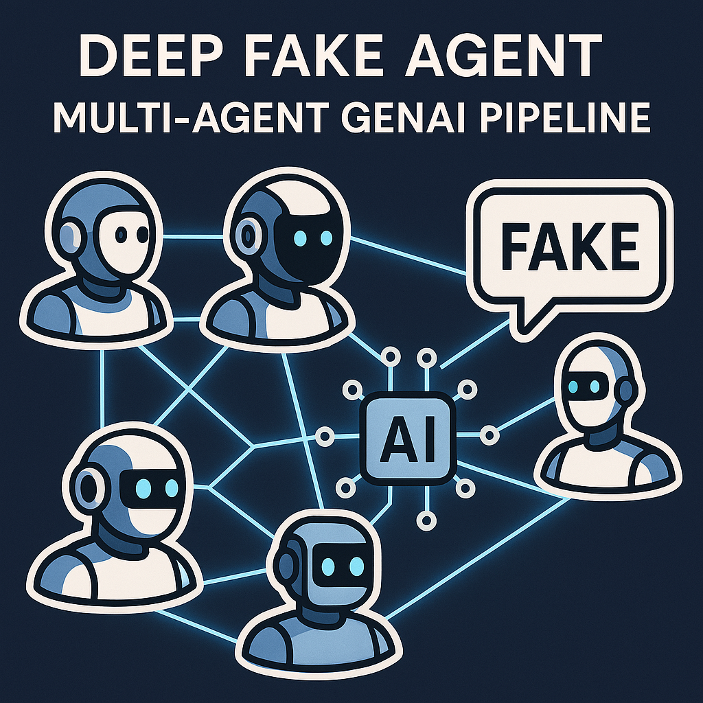

# 🤖 Deep Fake Agent · Multi-Agent GenAI Pipeline

<p align="center">
  
</p>


> A powerful and modular multi-agent system that simulates the creation and detection of synthetic video content using GenAI tools like LangGraph, LangChain, HuggingFace, and more. Built for research, prototyping, and real-world experimentation. 🧠🎥

## 🚀 Overview

**Deep Fake Agent** is a Generative AI pipeline that replicates how an AI system might autonomously generate fake content.  
It uses a team of AI agents 🤖 that communicate over a neural-like network to:

- Generate content (script, voice, video)
- Analyze and evaluate it
- And finally determine if it’s **FAKE** or not.

The entire flow is orchestrated via **LangGraph**, and each agent has a clearly defined, typed role within the pipeline.

---

## ✨ Features

- 📝 Script generation via LLM
- 📄 Script summarization
- 🔊 Voice generation using gTTS
- 🎬 Video creation from text and audio
- 🕵️ Deepfake detection using HuggingFace models
- 🤖 Modular agents using LangChain Expression Language (LCEL)
- ✅ Fully typed data flow with Pydantic
- 🪵 Detailed logs at each stage

---

## 🧠 Agent Architecture

The pipeline is composed of 6 core agents 🤖 that communicate sequentially as part of the LangGraph flow:

1. 🚀 **Start**  
   Initializes the flow and passes the initial state.

2. 🤖 **Script Agent**  
   Generates a text script using a language model (LLM).

3. 📄 **Summary Agent**  
   Summarizes the script to prepare it for narration.

4. 🔊 **Voice Agent**  
   Converts the summary to voice using gTTS.

5. 🎬 **Video Agent**  
   Combines the generated voice with visuals into a video.

6. 🕵️ **DeepFake Detector**  
   Analyzes the video using AI models to detect whether it’s fake or real.

7. ✅ **Final Checker**  
   Collects and formats the result of the classification.

8. 🏁 **End**  
   Ends the pipeline and returns the result.

---

## 🧰 Tech Stack

The project leverages a combination of GenAI frameworks, ML APIs, and multimedia tools:

- 🔁 **LangGraph + LangChain**  
  Used for agent orchestration, control flow, and building modular LCEL pipelines.

- 🧩 **Pydantic**  
  Provides structured data models for clean input/output between agents.

- 🗣️ **gTTS**  
  Enables lightweight, offline text-to-speech generation.

- 🎞️ **MoviePy + Pillow**  
  Used for video frame rendering, adding voiceover, and generating video clips.

- 🤖 **HuggingFace Inference API** (for Deepfake detection):  
  - [`dima806/deepfake_vs_real_image_detection`](https://huggingface.co/dima806/deepfake_vs_real_image_detection)  
  - [`prithivMLmods/Deep-Fake-Detector-v2-Model`](https://huggingface.co/prithivMLmods/Deep-Fake-Detector-v2-Model)  
  - [`prithivMLmods/Deepfake-Real-Class-Siglip2`](https://huggingface.co/prithivMLmods/Deepfake-Real-Class-Siglip2)

---

## 📁 Project Structure

Here's an overview of the project folder structure:

- `agents/` – All LCEL agents (script, summary, voice, video, deepfake, checker)
- `utils_graph/` – Helper modules (media tools, LangChain utils)
- `config/` – Settings and environment variables
- `assets/` – Static resources (images, icons, etc.)
- `data/` – Prompt text templates
- `main.py` – Entry point for executing the pipeline
- `template.py` – Video layout logic
- `load_env.py` – Loads environment variables
- `uni_test_main.py` – Runs the full flow as a unit test
- `requirements.txt` – Python dependencies
- `README.md` – You’re reading it 😎

---

## ⚙️ Installation

To run this project locally:

1. Clone the repository:

```bash
git clone https://github.com/Khaliel21/deepfake-multi-agents.git
cd deepfake-multi-agents